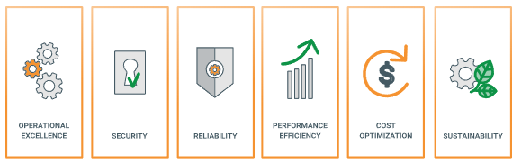
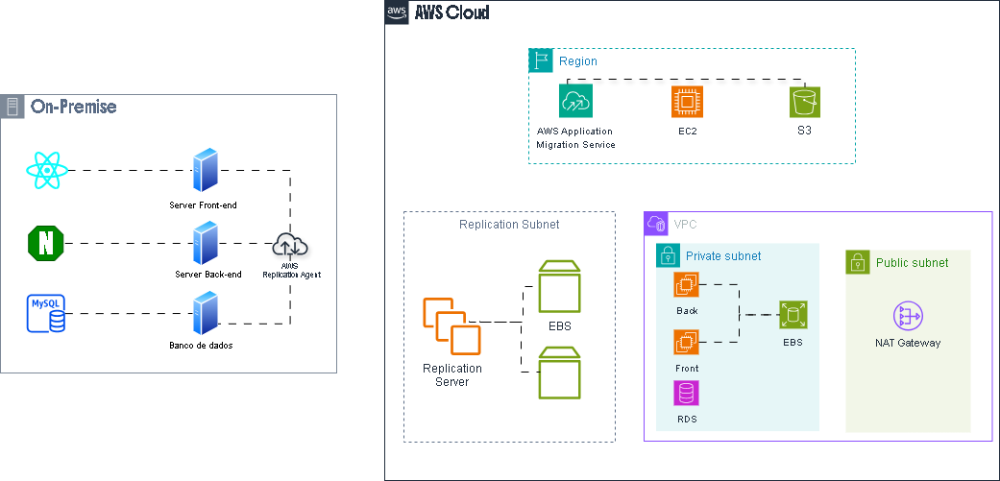
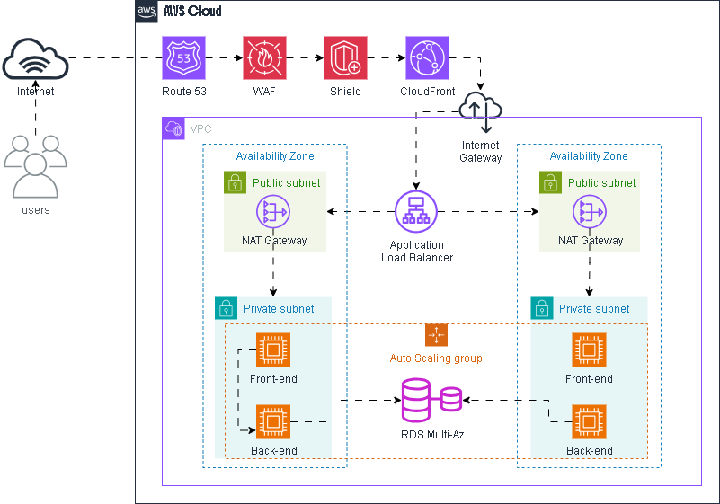
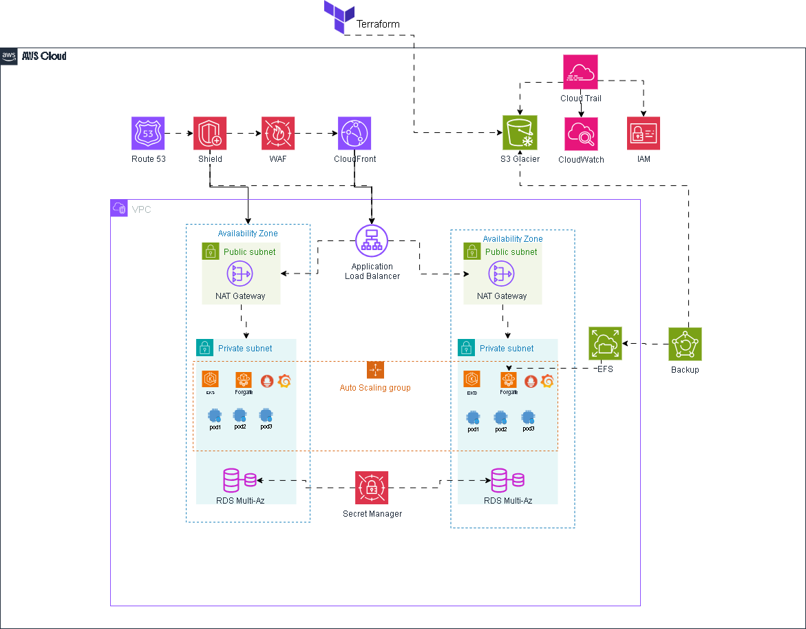

<h1 align="center">
     Compass UOL - DevSecOps
</h1>

# Projeto de Modernização de Infraestrutura na AWS

## 📌 Visão Geral

Este projeto tem como objetivo migrar a infraestrutura de um e-commerce para a AWS, garantindo alta disponibilidade, escalabilidade e segurança. A transição ocorre em duas fases: 

1. **Migração "As-Is" (Lift-and-Shift)**: Transferência rápida da infraestrutura on-premises para a AWS.
2. **Modernização**: Implementação de uma arquitetura baseada em Kubernetes para otimizar a performance e a gestão dos serviços.

## 🏗 Arquitetura do Projeto

### 🔹 Situação Atual
A infraestrutura atual consiste em:
- **Banco de Dados**: MySQL (500GB de dados, 10GB de RAM, 3 Core CPU)
- **Frontend**: React (5GB de dados, 2GB de RAM, 1 Core CPU)
- **Backend**:
  - 3 APIs
  - Nginx como balanceador de carga
  - Armazenamento de arquivos estáticos (5GB de dados, 4GB de RAM, 2 Core CPU)

### 🔹 Arquitetura na AWS
A nova infraestrutura na AWS segue os pilares da AWS Well-Architected Framework e será dividida em duas etapas:

#### 🛠 **Fase 1: Lift-and-Shift (Migração As-Is)**
- **Migração dos servidores on-premises para a AWS** utilizando o AWS Application Migration Service (MGN).
- **Infraestrutura baseada em Amazon EC2** com balanceamento de carga via Elastic Load Balancing.
- **Banco de dados migrado para Amazon RDS (MySQL)** com Multi-AZ habilitado.
- **Armazenamento de arquivos no Amazon S3**.
- **Monitoramento e logging com Amazon CloudWatch e AWS X-Ray**.

#### 🚀 **Fase 2: Modernização com Kubernetes**
- **Containers gerenciados pelo Amazon EKS** para melhorar a escalabilidade.
- **Imagens armazenadas no Amazon ECR**.
- **Armazenamento compartilhado via Amazon EFS**.
- **Gerenciamento de tráfego com Amazon Route 53 e Amazon CloudFront**.
- **Segurança reforçada com AWS WAF e AWS Secrets Manager**.

## 🏛 Serviços AWS Utilizados

Ícone | **Serviço AWS** | **Função no Projeto** |
|--- | --- | --- |
|  | **Amazon EC2** | Hospedar e executar as aplicações e serviços essenciais. |
|  | **Application Load Balancer** | Distribuir o tráfego. |
|  | **AWS Application Migration Service (MGN)** | Automatizar a migração de servidores. |
|  | **Amazon RDS for MySQL** | Banco de dados relacional gerenciado. |
|  | **Amazon VPC** | Criar uma rede isolada e segura. |
|  | NAT (Network Address Translation) | Serviço de tradução de endereços de rede. |
|  | Internet Gateway | Componente de rede para comunicação com a Internet. |
|  | **Amazon S3** | Armazenamento escalável para arquivos e backups. |
|  | **S3 Glacier Instant Retrieval** | Armazenamento de longo prazo. |
|  | **Amazon CloudWatch** | Monitoramento de métricas e logs. |
|  | **Amazon EKS** | Orquestração de containers Kubernetes. |
|  | **Amazon Route 53** | Gerenciamento de DNS. |
|  | **Amazon EFS** | Armazenamento compartilhado para múltiplas instâncias. |
|  | **Amazon ECR** | Armazenamento de imagens Docker. |
|  | **AWS WAF** | Proteção contra ataques na camada web. |
|  | **Amazon CloudFront** | Distribuição de conteúdo globalmente. |
|  | **AWS Secrets Manager** | Gestão segura de credenciais. |
|  | **AWS Backup** | Automação e gerenciamento de backups. |
|  | **AWS CodeBuild** | Construção e testes automáticos no CI/CD. |
|  | **AWS CodePipeline** | Fluxo automatizado de CI/CD. |
|  | **AWS CodeCommit** | Repositório Git seguro para armazenar o código-fonte do projeto. |
|  | **AWS CodeDeploy** | Automatizar implantações de código para EC2, EKS e outros serviços AWS. |

## 📊 Diagramas da Arquitetura

1. **Fase 1: Migração (Lift-and-Shift)**
   

2. **Infraestrutura Pós-Migração**
   
   
3. **Fase 2: Modernização (Kubernetes)**
   

4. **Fluxo de Deploy**
   

## 💰 Estimativa de Custos na AWS
A estimativa de custos foi calculada utilizando a ferramenta **AWS Pricing Calculator**.

📄 Detalhes da estimativa podem ser encontrados no arquivo: [Estimativa AWS Calculator](aws_calculator.pdf)

## 📜 Conclusão
O projeto propõe uma migração eficiente e uma modernização segura, garantindo um ambiente de alta disponibilidade e escalabilidade na AWS. A infraestrutura planejada atende às necessidades do cliente, promovendo melhor desempenho e segurança para o e-commerce.

---

✍ **Desenvolvido por:** 

<h1 align="center">
     Compass UOL - DevSecOps
</h1>

